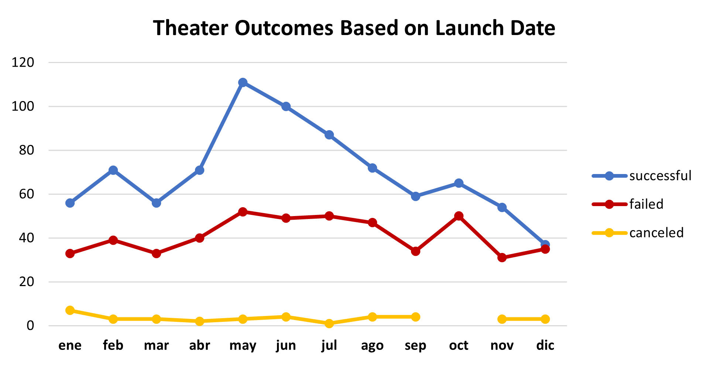
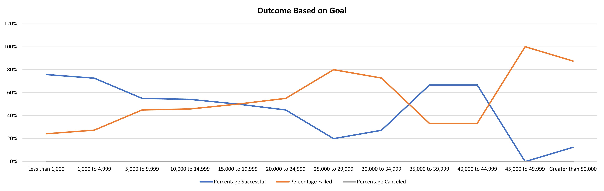

# Kickstarting with Excel

## Overview of Project

Crowdfunding is an alternative financing scheme based on raising small amounts of money from a large number of contributors. Crowdfunding projects are executed on a daily basis all over the world, each one with its own logistical and financial particularities such as country and currency based on its geographical location, a different creation, and due date, different categories, etc. All of them have in common is a money goal that they try to reach to succeed project's completion.   

To ensure new projects are successful, we want to understand how the different variables affect the final outcome. 

### Purpose

**We want to understand how different crowdfunding projects campaigns fared in relation to their launch dates and their funding goals.** 

To start this analysis, we have the historical information for 4,115 crowdfunding projects around the world with useful information such as Money Goal, Money Pledged, Outcome, Creation Date, etc. That we have reviewed, analyze, and prepare to uncover trends and provide insights. 

We have worked out our data in two workbooks named: 

1) data-1-1-3-StarterBook.xlsx
2) Kickstarter_Challenge.xlsx

Each workbook contains the main data source at the "Kickstarter" tab and its respective analysis, the present document related to the insights found at Kickstarter_Challenge.xlsx

## Analysis and Challenges

To assess the question, we executed two technical analyses over a reviewed and modified basis, we also created some extra variables to provide some additional information. Main challenge was to work with large data basis, not only for the data itself but because of the diversity and the potential unobservable variables affecting outcome. To increase our explanation ability, we focused in specific categories/ subcategories of projects. Additional minor challenges included Data with uncommon formats and measurements that we needed to adjust to provide accessible insights. 

### Analysis of Outcomes Based on Launch Date

To identify the potential relation among Outcome and Launch Date, we focused on Theater projects: 

From the shown graph we can conclude: 

1) It does not seem to be an specific timing during the year for canceled projects but January is the highest cancelation month. 
2) **April to August are the best months to launch and having success, picking in May.**
3) December is the worst month to launch since is the one with lowest success rate. 

*Note although May is the month with more success projects it is also the month with more total projects, thus, we also reviewed the success and cancelation outcomes as percentages and found consistency with the conclusions shown before.* 

### Analysis of Outcomes Based on Goals

Moving forward to understand potential relation among Outcome and Goal we focused on Plays: 

From the graph above, it seems we can split the relation in two considering 25 to 29 k as a break point, nevertheless, **note 96% of the total observations are for lower than 25 k goal, thus, this should be our main focus to reach solid conclusions**:

1) There is a negative correlation between success rate and goal.
2) Goals up to 5k have over 70% of success rate while 10 to 20 k are still a little over 50% success rate. 

## Results & Recommendations

Based on our analysis, we reached two main conclusions to maximize success chances:

1) For Theater projects, launch the project from April to August ideally during May.
2) For Plays projects, if possivle, use goals up to 5 k that got a high success rate, greater goals reduces success rate considerably. Avoid goals over 20 k since their sucecss rate is lower than 50%

Final comments: 

As long as we keep using data to support decision making, we should assume some data as creation date would be affected, thus, we may want to start using percentages per period and not total values to ensure we are not having missleading conclusions due to this change.    

Further analysis is recommended to fully understand why a few observations suggest that some projects in the range from 35 to 45 k may have a high success rate and if this can be used somehow.   

